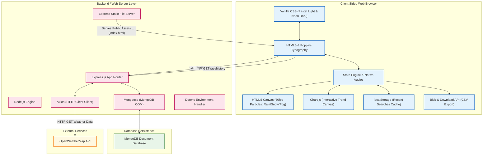

# Technical Stack Overview: Weather Trend Visualizer

This document provides an exhaustive breakdown of the architectural design, technologies, frameworks, libraries, and browser APIs utilized in the **Weather Trend Visualizer** full-stack web application.

---

## 🏗️ Architectural Diagram

The application is built on a modern **three-tier architecture** that seamlessly orchestrates frontend interaction, backend API routing, database persistence, and external data services:



---

## 🎨 1. Frontend Technologies & Rich Interface Design

The frontend prioritizes high-fidelity visual design, responsive components, and dynamic micro-animations without relying on heavy frameworks.

### 💻 Core Tech & Languages
*   **HTML5 Semantic Markup**: Structure of the page, implementing elements like `<canvas>`, `<audio>`, inputs, buttons, and accessibility structures (`role="dialog"`, `aria-modal="true"`, `aria-live="polite"`).
*   **Vanilla CSS3 (Custom Design System)**:
    *   **Dual Color Palette (CSS Variables)**: Smooth styling tokens dynamically swapped to toggle between a pastel gradient light mode (**Mode: Colorful**) and a dark sci-fi backdrop (**Mode: Neon Dark**).
    *   **Glassmorphism Pattern**: Utilizing `backdrop-filter: blur(12px) saturate(130%)`, thin borders, translucent backgrounds, and soft-glow box shadows (`box-shadow: var(--card-glow)`) to mimic futuristic frosted glass panels.
    *   **Keyframe Animations**: Continuous dynamic animations such as `drift` (creates a slow, moving landscape parallax background effect), `sunPulse` (scales the sun and shifts its neon box-glow), and `cloudFloat` (flows cloud layers across the viewport).
*   **Vanilla JavaScript (ES6+)**: Handles page events, DOM manipulation, asynchronous network requests, audio triggers, modal lifecycles, and triggers coordinate calculations.

### 📊 Visualization & Graphic Libraries
*   **Chart.js**: Rendered on a 2D canvas context to visualize temperature predictions.
    *   Features smooth Bezier curves (`tension: 0.4`), thick premium borderlines, and custom-styled linear gradients underneath (`ctx.createLinearGradient`).
    *   Integrates interactive dynamic tooltips styled matching the active glassmorphic theme.
    *   Ensures clean memory management by properly destroying current chart instances (`chart.destroy()`) before plotting new trends.
*   **3D Weather Assets**: Integrated using vector representations and transparent 3D render images mapped to weather conditions to provide a tactile feeling.

### 🌦️ Native Simulation Engines & Audios
*   **60FPS Canvas Particle System**: Written from scratch, utilizing standard 2D rendering contexts inside an request animation loop (`requestAnimationFrame`). It generates physics-based particles matching weather states:
    *   *Rain*: Dynamic vertical lines shifting diagonally with randomized speeds.
    *   *Snow*: Drifting circular flakes swaying using trigonometric sine calculations (`Math.sin(p.y * 0.01)`).
    *   *Fog*: Large, highly translucent fuzzy circles shifting slowly to mimic low visibility.
    *   *Wind*: Subtle horizontal speed lines flying across the canvas.
*   **Weather Soundtracks**: Utilizes standard browser HTML5 `<audio>` tags (`rainSound`, `thunderSound`) controlled through Javascript API to play looping nature audio tracks during rainy or stormy conditions.

---

## ⚙️ 2. Backend Technologies & Data API Router

The backend serves as a high-performance routing API server that acts as a secure buffer between the client browser and external integrations.

### 🌐 Server Core
*   **Node.js**: The asynchronous, event-driven Javascript runtime serving as the base layer.
*   **Express.js (v5.1.0)**: Used to coordinate routes, apply middlewares, and host API endpoints.
    *   `cors()`: Cross-Origin Resource Sharing middleware enabling safe cross-domain resource access.
    *   `express.json()`: Middleware designed to parse incoming JSON request payloads.
    *   `express.static()`: Securely serves public static folders (`weather/Public`) so that the visual UI is delivered right from the root web path.
*   **Dotenv (v17.2.3)**: Separates configuration variables from codebase logic. It safely injects sensitive keys (`OPENWEATHER_KEY`) and server-wide configurations (`PORT`, `MONGO_URI`) from a local `.env` file into Node's runtime environment.

### 🛠️ Data Handlers & Communication Clients
*   **Mongoose (v9.0.0)**: A schema-based Object Document Mapper (ODM) for MongoDB.
    *   Defines structured data schemas:
        ```javascript
        const weatherSchema = new mongoose.Schema({
            city: String,
            temperatures: [Number],
            times: [String],
            createdAt: { type: Date, default: Date.now }
        });
        ```
    *   Performs database inserts asynchronously (`Weather.create(...)`) without blocking API operations.
*   **Axios (v1.13.2)**: A promise-based HTTP client utilized on the server backend to execute high-speed external API queries.

---

## 💾 3. Database & Storage Architecture

Data persistence is managed at two distinct layers (server-side long-term logging and client-side fast caching).

### 🗄️ Server Database
*   **MongoDB**: NoSQL document database used to maintain persistent record logs of queried locations.
*   **Resilient Database Connector**: Dynamically evaluates environmental variables. If `MONGO_URI` is not present, it fails gracefully over to a local instance fallback (`mongodb://127.0.0.1:27017/weatherDB`), ensuring the app operates regardless of system constraints.

### 📦 Client-Side Storage & Data Export
*   **Web Storage (localStorage)**: Saves search records under `wtv_history_colorful_v1` on the user's hard drive.
    *   Ensures that only the **5 most recent unique cities** are stored, preventing storage inflation.
    *   Allows immediate client-side reloading of cached cities without forcing redundant backend round-trips.
*   **Data Export (Blob & virtual download trigger)**:
    *   Constructs a standard CSV table containing the 48-hour timestamp and temperature sequences directly inside browser memory.
    *   Wraps the text within a Javascript `Blob` (Binary Large Object) of type `text/csv`.
    *   Generates a safe memory URL (`URL.createObjectURL(blob)`) and triggers a virtual, hidden anchor tag click to download a file named `Weather_Trend_Report_<CityName>.csv`.

---

## 🔌 4. External Services

*   **OpenWeatherMap API**: The global weather intelligence database used to gather detailed forecasts.
    *   The app leverages the `/data/2.5/forecast` query using metrics units (`units=metric`).
    *   The raw multi-day forecast list is sliced to capture precisely the first **16 intervals** (representing 48 hours / 2 days at 3-hour increments) to chart near-term weather trends.

---

> [!NOTE]
> ### Why this stack works so well
> This modular full-stack stack achieves a perfect balance: the server handles secure API interactions and long-term logging with MongoDB, while the browser leverages vanilla CSS/JS and Chart.js for smooth, animated visual rendering at 60 FPS. If the local API server is offline or unavailable, the client automatically defaults to high-quality synthetic demo datasets, guaranteeing a consistent user experience.
